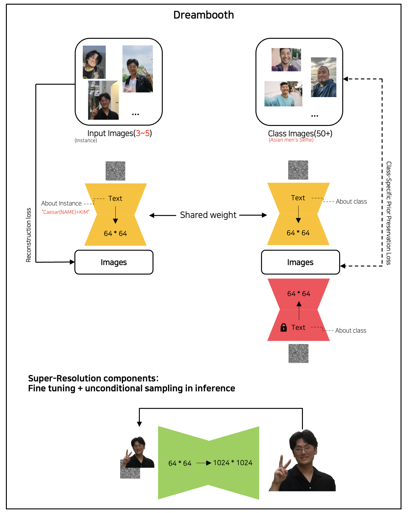
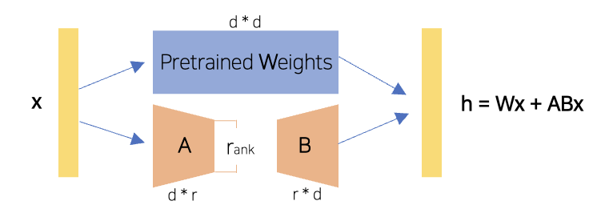
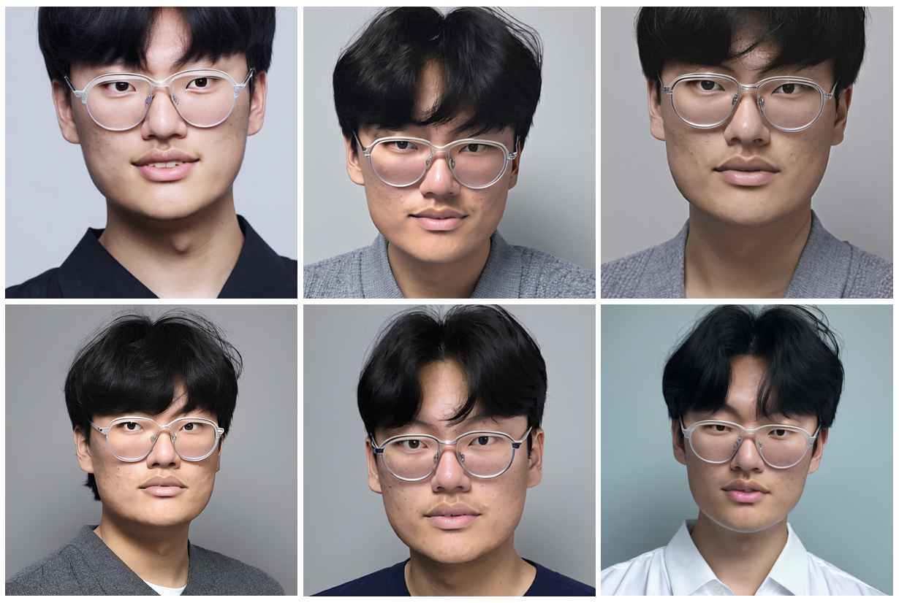
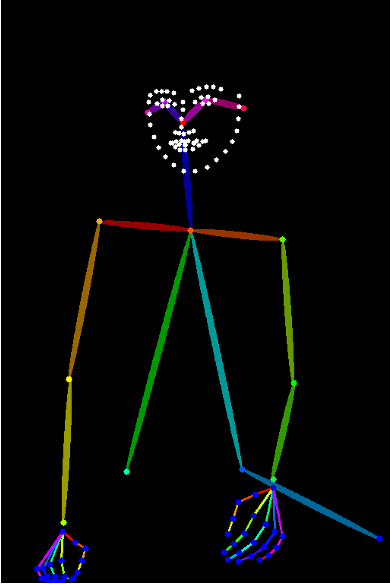
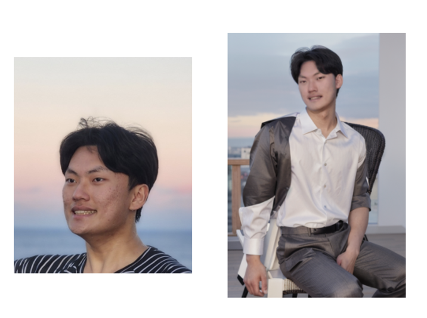
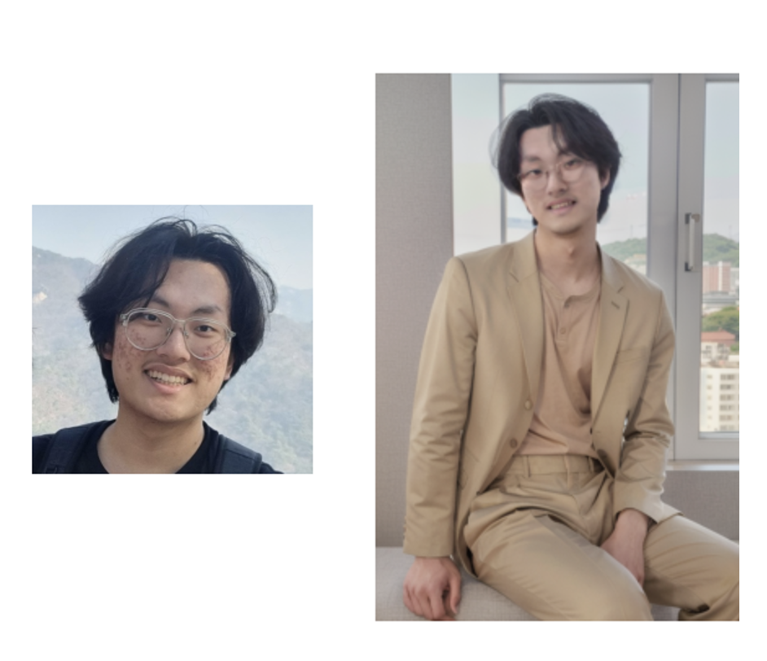
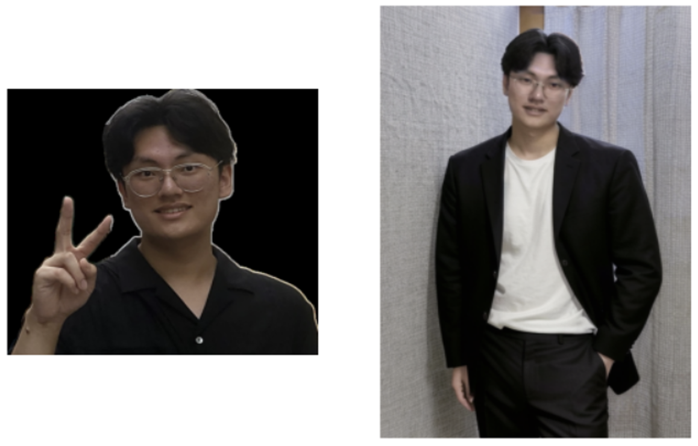
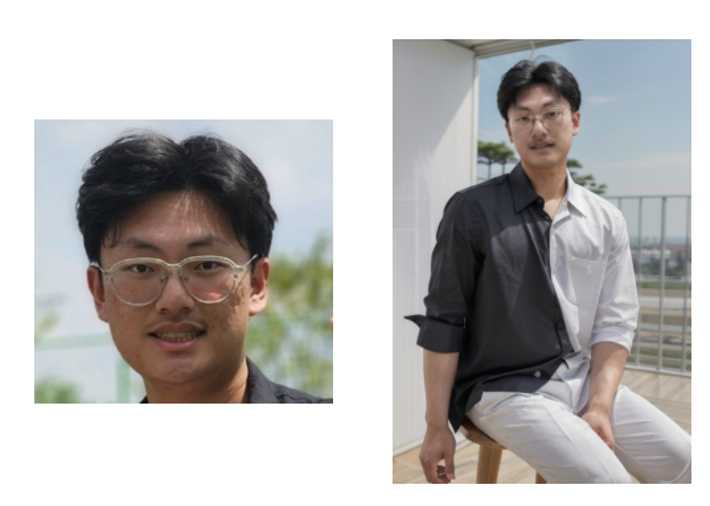

# MyPhoto_madebyAI

This repo is for an AI service project that provides ID photos and profile photos. The service is based on the Stable Diffusion model and the Dreambooth model. The Stable Diffusion model is a generative model that can generate high-quality images. The Dreambooth model is a fine-tuned version of the Stable Diffusion model that can generate images with a specific style.  

I plan to serve this through an app or website to create a revenue structure. If you're interested in collaborating, please contact me at hwk06023@gmail.com.  

### Outline

- [Fine-tuning the RealisticVision model of Stable Diffusion with Dreambooth](#fine-tuning-the-realisticvision-model-of-stable-diffusion-with-dreambooth)
  * [Architectrue example](#architectrue-example)
  * [Hyperparameters](#hyperparameters)
  * [Application](#application)
  * [LoRA (Low Rank Adaptation)](#lora--low-rank-adaptation-)
  * [Result - ID Photo](#result---id-photo)
- [Effective service pipeline through a generic model](#effective-service-pipeline-through-a-generic-model)
  * [Service pipeline](#service-pipeline)
  * [DWPose example](#dwpose-example)
  * [Result - Profile Photo](#result---profile-photo)

## Fine-tuning the RealisticVision model of Stable Diffusion with Dreambooth

#### Architectrue example

### Hyperparameters

#### Prior_loss_weight(loss func’s lambda value)
A constant value is multiplied by the class loss, serving as regularization to prevent overfitting to the instance. However, due to the issue of becoming less similar to the instance (underfitting), I gradually reduced the value from the 1.0 suggested in the paper and tested it.

#### Learning rate, Training steps
By appropriately adjusting these two values, I was get the better result about underfitting and overfitting.

### Application

#### Recontextualization (Text prompt)
The sentences were generated in the format specified by the authors, **"a [V] [class noun] [context description]."** Furthermore, for the V (Instance noun) to fit better, the name part was composed of less commonly used words by applying a Caesar cipher.

### LoRA (Low Rank Adaptation)

  

Rather than updating the entire model's weights, effective fine-tuning is achieved by only updating additional parameters using the Low-rank technique. This approach results in significant savings of time and resources.  

It was convenient to apply since it is available with Dreambooth on Huggingface.  

### Result - ID Photo

  

However, I thought it was impractical from a business standpoint to conduct fine-tuning for personalized models every time the number of users increases. Therefore, an effective service pipeline is needed through a generic model.

## Effective service pipeline through a generic model

### Service pipeline

1. Creating Reference Profile Photos with a Stable Diffusion-Based Model
2. Getting the subject's pose with DWPose
3. Using the image2text model to obtain information on the subject's attire, expression, and background to input into the prompt
4. Feeding IP Adapter and Open-pose data into ControlNet, which is based on the Realistic Vision model (Generic model), to generate a temporary profile photo.
5. Completing the image by enhancing the detailed facial information with FaceSwapLab's INSwapper

### DWPose example

  

### Result - Profile Photo

Previously, fine-tuning for each user took about 30 minutes due to the time required for the process. However, this pipeline's process could be completed in around **just 1 minute**, which made it significantly meaningful.  

  
  
  
  

However, there were drawbacks in terms of performance. The results appeared somewhat Westernized, leading me to conclude that the Realistic Vision model used was biased due to being fine-tuned with predominantly Western data. Consequently, I wanted to retest using a Realistic Vision model trained primarily on Asian data, but I could only find models trained mainly on female Asian data.  

Realistically, if data and resources are available, it would be more effective in the long run to build and service our own generic Realistic Vision models based on different races and genders.  